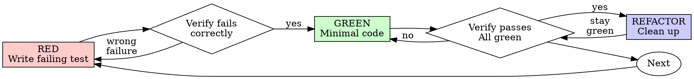

# Test-Driven Development (TDD)

## Overview

Write the test first. Watch it fail. Write minimal code to pass.

**Core principle:** If you didn't watch the test fail, you don't know if it tests the right thing.

**Violating the letter of the rules is violating the spirit of the rules.**

## The Iron Law

```
NO PRODUCTION CODE WITHOUT A FAILING TEST FIRST
```

Write code before the test? Delete it. Start over.

**No exceptions:**

- Don't keep it as "reference"
- Don't "adapt" it while writing tests
- Don't look at it
- Delete means delete

Implement fresh from tests. Period.

## Outside-In Development

Start every feature with a high-level test that describes behavior from the user's perspective. Let each failure guide what to build next. Drop to unit tests when you encounter non-trivial logic.

Read `examples/outside-in-testing.md` for a complete walkthrough and `examples/testing-pyramid.md` for how test types combine into an optimal suite.

### The Outer Loop: Feature Specs

1. Take the user story
2. Write a feature spec describing the behavior end-to-end
3. Run it — watch it fail
4. The error tells you what to build next: a route, a controller action, a view, a model method
5. Build the minimum to get past that error
6. Run again — next error drives next piece
7. When you hit non-trivial logic, drop to the inner loop

Feature specs use real database records. No mocks — except for external services (use webmock or fakes). Tests should run without an internet connection.

### The Inner Loop: Unit Tests

When the feature spec error points to logic that needs its own proof — a search method, a calculation, a validation rule:

1. Write a unit test for that specific behavior
2. Follow Red-Green-Refactor (below)
3. Pass the unit test
4. Return to the feature spec — next error drives next piece

Unit tests isolate the object under test. Mock collaborators aggressively — the goal is to prove the functionality of this object, not its collaborators. Difficulty testing two objects in isolation signals too-tight coupling.

### When to Drop Down

Not every piece needs a unit test. The feature spec covers the glue.

**Just build it** (feature spec covers it):

- Routes
- Empty controller actions
- Simple views and partials
- Wiring and delegation

**Unit test first** (non-trivial logic):

- Model methods with business logic
- Service objects
- Query objects
- Calculations, validations, transformations

The testing pyramid: many unit tests at the bottom, few feature tests at the top. Unit tests are fast and precise. Feature tests prove the system works end-to-end. Each plays to its strengths.

## Red-Green-Refactor

The inner cycle. Every unit test follows this loop — and so does each error-driven step in the outer loop.



### RED — Write Failing Test

Write one minimal test showing what should happen.

<Good>

```ruby
RSpec.describe Item, ".search" do
  it "filters items by the search term" do
    desired_item = create(:item, name: "Widget")
    _other_item = create(:item, name: "Gadget")

    expect(Item.search("Widget")).to eq [desired_item]
  end
end
```

Clear name, tests real behavior, one thing.

</Good>

<Bad>

```ruby
it "search works" do
  relation = spy("relation")
  allow(Item).to receive(:where).and_return(relation)

  Item.search("Widget")

  expect(Item).to have_received(:where).with(name: "Widget")
end
```

Vague name, tests spy interactions not real behavior, proves nothing about whether search actually returns the right items.

</Bad>

**Requirements:**

- One behavior
- Clear name
- Feature specs: real records, no mocks (except external services)
- Unit tests: mock collaborators, test the object in isolation

### Verify RED — Watch It Fail

**MANDATORY. Never skip.**

```bash
bundle exec rspec spec/models/item_spec.rb
```

Confirm:

- Test fails (not errors)
- Failure message is expected
- Fails because feature missing (not typos)

**Test passes?** You're testing existing behavior. Fix test.

**Test errors?** Fix error, re-run until it fails correctly.

### GREEN — Minimal Code

Write simplest code to pass the test.

<Good>

```ruby
class Item < ApplicationRecord
  def self.search(term)
    where(name: term)
  end
end
```

Just enough to pass.

</Good>

<Bad>

```ruby
class Item < ApplicationRecord
  def self.search(term, fuzzy: false, limit: nil, scope: :all)
    # YAGNI — the test asked for name filtering, not a search framework
  end
end
```

Over-engineered.

</Bad>

Don't add features, refactor other code, or "improve" beyond the test.

### Verify GREEN — Watch It Pass

**MANDATORY.**

```bash
bundle exec rspec spec/models/item_spec.rb
```

Confirm:

- Test passes
- Other tests still pass
- Output pristine (no errors, warnings)

**Test fails?** Fix code, not test.

**Other tests fail?** Fix now.

### REFACTOR — Clean Up

After green only:

- Remove duplication
- Improve names
- Extract helpers

Keep tests green. Don't add behavior.

### Repeat

Return to the feature spec. Next error drives the next piece. Drop to unit tests when needed. Continue until the feature spec is green.

## Good Tests

| Quality          | Good                                | Bad                                              |
| ---------------- | ----------------------------------- | ------------------------------------------------ |
| **Minimal**      | One thing. "and" in name? Split it. | `it "validates email and domain and whitespace"` |
| **Clear**        | Name describes behavior             | `it "test1"`                                     |
| **Shows intent** | Demonstrates desired API            | Obscures what code should do                     |

## Why Order Matters

**"I'll write tests after to verify it works"**

Tests written after code pass immediately. Passing immediately proves nothing:

- Might test wrong thing
- Might test implementation, not behavior
- Might miss edge cases you forgot
- You never saw it catch the bug

Test-first forces you to see the test fail, proving it actually tests something.

**"I already manually tested all the edge cases"**

Manual testing is ad-hoc. You think you tested everything but:

- No record of what you tested
- Can't re-run when code changes
- Easy to forget cases under pressure
- "It worked when I tried it" ≠ comprehensive

Automated tests are systematic. They run the same way every time.

**"Deleting X hours of work is wasteful"**

Sunk cost fallacy. The time is already gone. Your choice now:

- Delete and rewrite with TDD (X more hours, high confidence)
- Keep it and add tests after (30 min, low confidence, likely bugs)

The "waste" is keeping code you can't trust. Working code without real tests is technical debt.

**"TDD is dogmatic, being pragmatic means adapting"**

TDD IS pragmatic:

- Finds bugs before commit (faster than debugging after)
- Prevents regressions (tests catch breaks immediately)
- Documents behavior (tests show how to use code)
- Enables refactoring (change freely, tests catch breaks)

"Pragmatic" shortcuts = debugging in production = slower.

**"Tests after achieve the same goals — it's spirit not ritual"**

No. Tests-after answer "What does this do?" Tests-first answer "What should this do?"

Tests-after are biased by your implementation. You test what you built, not what's required. You verify remembered edge cases, not discovered ones.

Tests-first force edge case discovery before implementing. Tests-after verify you remembered everything (you didn't).

30 minutes of tests after ≠ TDD. You get coverage, lose proof tests work.

## Common Rationalizations

| Excuse                                 | Reality                                                                 |
| -------------------------------------- | ----------------------------------------------------------------------- |
| "Too simple to test"                   | Simple code breaks. Test takes 30 seconds.                              |
| "I'll test after"                      | Tests passing immediately prove nothing.                                |
| "Tests after achieve same goals"       | Tests-after = "what does this do?" Tests-first = "what should this do?" |
| "Already manually tested"              | Ad-hoc ≠ systematic. No record, can't re-run.                           |
| "Deleting X hours is wasteful"         | Sunk cost fallacy. Keeping unverified code is technical debt.           |
| "Keep as reference, write tests first" | You'll adapt it. That's testing after. Delete means delete.             |
| "Need to explore first"                | Fine. Throw away exploration, start with TDD.                           |
| "Test hard = design unclear"           | Listen to test. Hard to test = hard to use.                             |
| "TDD will slow me down"                | TDD faster than debugging. Pragmatic = test-first.                      |
| "Manual test faster"                   | Manual doesn't prove edge cases. You'll re-test every change.           |
| "Existing code has no tests"           | You're improving it. Add tests for existing code.                       |

## Red Flags — STOP and Start Over

- Code before test
- Test after implementation
- Test passes immediately
- Can't explain why test failed
- Tests added "later"
- Rationalizing "just this once"
- "I already manually tested it"
- "Tests after achieve the same purpose"
- "It's about spirit not ritual"
- "Keep as reference" or "adapt existing code"
- "Already spent X hours, deleting is wasteful"
- "TDD is dogmatic, I'm being pragmatic"
- "This is different because..."

**All of these mean: Delete code. Start over with TDD.**

## Example: Feature (Outside-In)

**Story:** As a guest, I can search for items so I can find what I want.

**Outer loop — Feature spec**

```ruby
# spec/features/guest_searches_for_items_spec.rb
feature "Guest searches for items" do
  scenario "by name" do
    create(:item, name: "Widget")

    visit root_path
    fill_in "Search", with: "Widget"
    click_on "Search"

    expect(page).to have_content("Widget")
  end
end
```

Run it. First error: no route. Add the route. Next error: no controller. Create it. Next error: no `search` method on `Item` — drop to the inner loop.

**Inner loop — Unit test**

```ruby
# spec/models/item_spec.rb
RSpec.describe Item, ".search" do
  it "filters items by name" do
    desired = create(:item, name: "Widget")
    _other = create(:item, name: "Gadget")

    expect(Item.search("Widget")).to eq [desired]
  end
end
```

Verify RED. Implement `Item.search`. Verify GREEN. Return to feature spec. Next error drives next piece. Continue until the feature spec is green.

## Example: Bug Fix

**Bug:** Empty email accepted

Start with a feature spec reproducing the bug from the user's perspective, then drop to a unit test for the validation logic.

**Outer loop — Feature spec**

```ruby
# spec/features/guest_registers_spec.rb
feature "Guest registers" do
  scenario "with blank email" do
    visit new_registration_path
    fill_in "Email", with: ""
    click_on "Register"

    expect(page).to have_content("Email can't be blank")
  end
end
```

**Inner loop — Unit test**

```ruby
# spec/models/user_spec.rb
RSpec.describe User do
  it "rejects empty email" do
    user = User.new(email: "")

    expect(user).not_to be_valid
    expect(user.errors[:email]).to include("can't be blank")
  end
end
```

**GREEN**

```ruby
class User < ApplicationRecord
  validates :email, presence: true
end
```

Unit test passes. Return to feature spec. Continue until green.

## Verification Checklist

Before marking work complete:

- [ ] Every new function/method has a test
- [ ] Watched each test fail before implementing
- [ ] Each test failed for expected reason (feature missing, not typo)
- [ ] Wrote minimal code to pass each test
- [ ] All tests pass
- [ ] Output pristine (no errors, warnings)
- [ ] Tests use real code (mocks only if unavoidable)
- [ ] Edge cases and errors covered

Can't check all boxes? You skipped TDD. Start over.

## When Stuck

| Problem                | Solution                                                             |
| ---------------------- | -------------------------------------------------------------------- |
| Don't know how to test | Write wished-for API. Write assertion first. Ask your human partner. |
| Test too complicated   | Design too complicated. Simplify interface.                          |
| Must mock everything   | Code too coupled. Use dependency injection.                          |
| Test setup huge        | Extract helpers. Still complex? Simplify design.                     |

## Debugging Integration

Bug found? Write failing test reproducing it. Follow TDD cycle. Test proves fix and prevents regression.

Never fix bugs without a test.

## Testing Anti-Patterns

When adding mocks or test utilities, read `references/testing-anti-patterns.md` to avoid common pitfalls:

- Testing mock behavior instead of real behavior
- Adding test-only methods to production classes
- Mocking without understanding dependencies

## Final Rule

```
Production code → test exists and failed first
Otherwise → not TDD
```

No exceptions without your human partner's permission.
